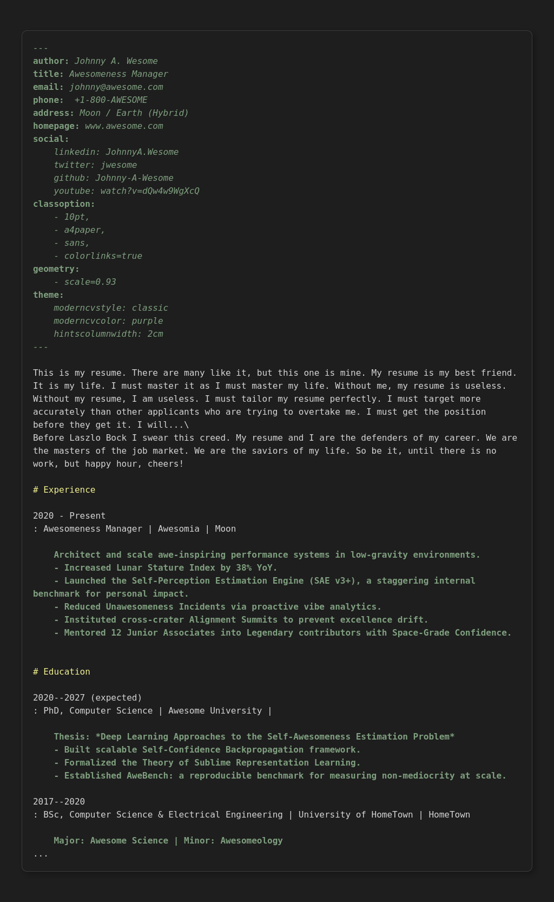
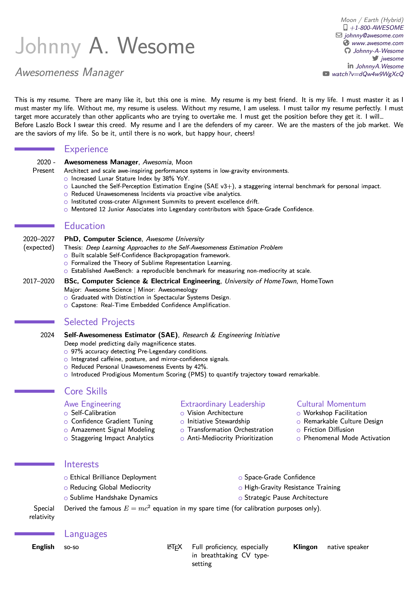

# Markdown to moderncv Filter

This Pandoc Lua filter converts Markdown resumes into PDF via LaTeX using the popular `moderncv` class. It expects a simple Markdown structure (YAML frontmatter + definition lists) and turns those into nicely formatted CV sections.

|Markdown source| |PDF output|
|:---:|---|:---:|
| |➡️||


# Requirements

- Pandoc 2.0 or newer
- LaTeX with `moderncv` package installed

# Getting started
- Clone this repo and navigate to it in your terminal.
- Make a copy of markdown/JohnnyCoder.md and [edit](#authoring-cv-content) it with your own info.
- Run `make pdf` in this repository to compile all files under `markdown/`.
- The result PDFs will be in the `output/` directory.


Direct Pandoc command:
```bash
pandoc your-resume.md --from markdown --to pdf --lua-filter=moderncv.lua --template=templates/moderncv.tex -o output.pdf
```

# Authoring CV content 
The content of the markdown file must be structured in a specific way for the filter to recognize it and convert it into the appropriate LaTeX commands. 

## Metadata (YAML)
Personal info and theme configuration go in the YAML frontmatter. 

### Basic personal info 
These populate CV header with the personal info. All except name are optional. 
- `name`: Your full name. Can also use `firstname` and `lastname`.
- `title`: The title of the document (e.g., "Curriculum Vitae" or "Business Analyst").
- `address`: Your mailing address.
- `phone` or `phones`: Your phone number(s).
- `email`: Your email address.
- `social`: A map of social media networks to usernames (e.g., `github: myuser`).
- `photo`: Path to a photo.

From this info a CV header will be produced:


### Theme options (optional): 
You only need specify options you want to change; sensible defaults are used otherwise.

- `fontsize`: Font size for the document (e.g., `10pt`, `11pt`, `12pt`).
- `papersize`: Paper size for the document (e.g., `a4paper`, `letterpaper`).
- `fontfamily`: Font family for the document (e.g., `sans`, `roman`).
- `moderncvstyle`: Style of the `moderncv` class (e.g., `classic`, `banking`, `casual`,  `oldstyle`, `fancy`, `contemporary`).
- `moderncvcolor`: Color scheme for the `moderncv` class (e.g., `blue`, `green`, `red`).
- `scale`: Scale factor for the  (e.g., `0.8`, `0.93`).
- `hintscolumnwidth`: width of the left column for terms (e.g., `2cm`, `3cm`, etc)

Example minimal Frontmatter:

```markdown
---
firstname: Johnny
lastname: Coder
title: Curriculum Vitae
address: "123 Parkway Drive, Mytown, Mycountry"
phone: "+00 (0)00 000 0000"
email: "email@example.com"
homepage: "www.johnnycoder.com"
social:
  github: Johnny-Coder
  linkedin: johnny-coder
theme:
  moderncvstyle: classic
  moderncvcolor: purple
  scale: 0.9
  hintscolumnwidth: 3cm
---
```

## CV Sections 
The CV is separated into sections (such as `# Experience`, `# Education`, etc.) using standard `#` and `##` section headings. `##` are optional and can be used for further sub-sectioning if needed.

## CV items 

The main content of your resume is created using [Extended Markdown definition lists](#appendix-understanding-definition-lists) under section headings. The structure of the definition list determines how the content is rendered in the final PDF. \
The syntax is designed with the intent that the visual structure you want in the PDF should be roughly mirrored by the structure of the definition list in Markdown.  
Inline **formatting** is *preserved* in terms, definitions and the block content.

Below are minimal examples for each implemented entry type; markdown on top, resulting Rendered PDF block below. 

## Compact items 

A collection of `category - content(s)` items spread across one, two or three columns. 

- Compact items have no block content. 
- Number of fields must be the same among all definitions in an item.
- Compact items can have multiple definitions per term. They will appear as multiple contents under single category.
- If you need each content to be under it's own category, just create multiple items. 

There are several types of compact items:

### Item
Single term field, single definition field

* A simple item 

```markdown
# Interests

hobby 1
: Description 1

hobby 2
: Description 2

hobby 3
: Description 30
: Description 31
```


### Item with comment
Single term field, 2 definition fields  

* The comment is aligned to the right of the page

```markdown
# Languages

English
: Fluent | learned in school

Language 2 
: Skill level | Comment

Language 3
: Writing | Expert
: Speaking | Basic 
```


### Double / Triple item

Term with `n` (either 2 or 3) fields + definition(s) with `n` fields,  
`n` determines whether it's a double or triple item. \

* It is recommended not to mix double/triple items within the same section, as it will lead to inconsistent formatting (as shown below).

```markdown
# Computer Skills

Programming | Tools
: Python, C++ | Git, Docker

category 3 | category 6
: XXX | YYY
: ZZZ | TTT
: WWW | UwU

Left | Center | Right
: A | B | C
: D | E | F
```


### List item
Single empty term + multiple definitions. 

* Empty term means it must be just a single pipe char. It is omitted from output, only the definitions are rendered as the list.

```markdown
# Hobbies

|
: Skiing
: Cooking
: Photography
```


### Double-column list item

Single empty term + 2 fields in **All** definitions  

```markdown
# Hobbies

|
: Item A | Item D
: Item B | Item E
: Item C | Item F
```


## Detailed entry (job / project / education)
Single Term + **single** definition with **up to 4** fields and an **indented** block content.  

* Used for job/project/education with rich description 

```markdown
# Experience

2018--2024
: Senior Engineer | Acme Corp | Remote

    Led platform team.
    - Built APIs
    - Improved reliability
```


## Columns (multiple named columns)
Single Term + **multiple** definitions, **each with an indented** block content 

Rich content spread across multiple named columns.  
The Term is omitted from output, only the definitions are rendered as columns.  
The number of definitions determines the number of columns.  
The content of each definition is rendered within the corresponding column, and block content formatting is preserved.

```markdown
# References

Term (omitted)
: Category 1

    Regular block content for category 1, which can include lists, code blocks, etc.

: Category 2

    - **Person 1**
    - Person 2
    - Person 3

: All the rest & some more

    That person and those also (all available upon request).
```


That's the minimal quickstart. For full details, examples and edge cases see the files in `docs/`.


# Appendix: Understanding Definition Lists 

### Basic Structure

A definition list in Markdown looks like this:

```markdown
Term 1
: Definition 1
    block content for Definition 1 (optional).
    - some complex formatting (optional)
    more content (optional)
: Definition 2 (optional).
    block content for Definition 2 (optional).

Term 2
: Definition 3
    block content for Definition 3 (optional).
```

- **Term**: The title or heading for the entry.
- **Definition**: The content or description associated with the term.
- **Block Content**: Optional additional content, such as paragraphs, lists, or code blocks, **indented** under the definition.

### Extended Structure with Fields

To represent more complex CV items, this project introduces composite terms and definitions: ones that can be split into multiple fields using the pipe (`|`) character. For example:

```markdown
Term Field 1 | optional Term Field 2
: Definition Field 1 | optional Definition Field 2
    block content for the definition (optional).
```

- **Fields**: Subdivisions within terms or definitions, separated by `|`. These allow for multi-column layouts or additional metadata.

### Mapping to CV Item Types

Extended Definition lists are the core structure used to represent CV entries in this project. 
The type of CV item generated in the final PDF depends on:

- The number of definitions per term.
- The number of fields within each term and definition.
- Whether block content is present in the first definition.